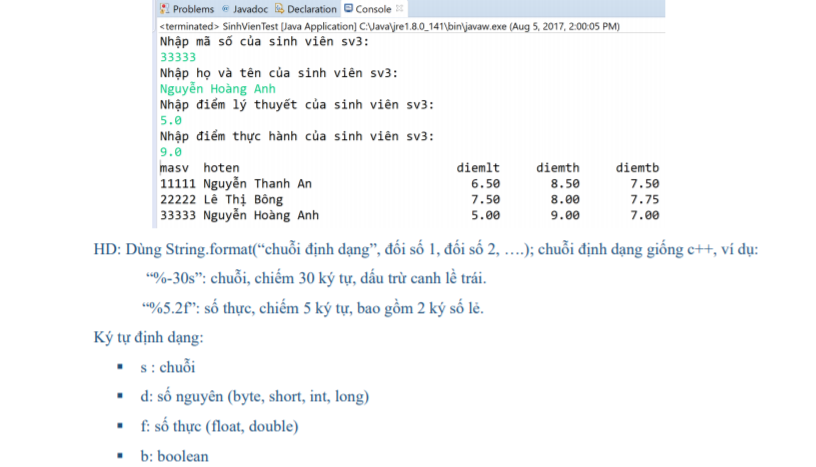
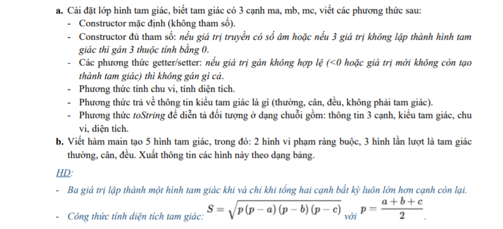
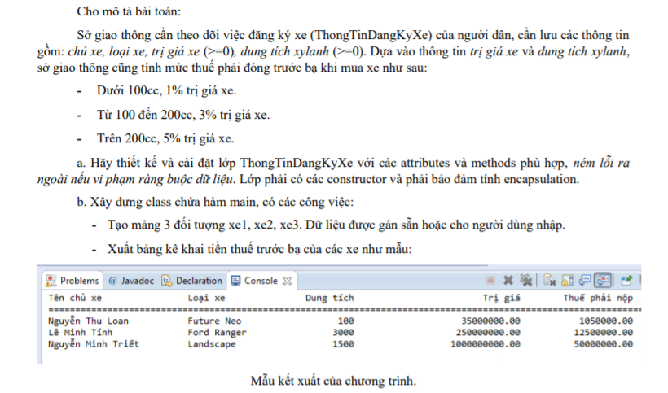
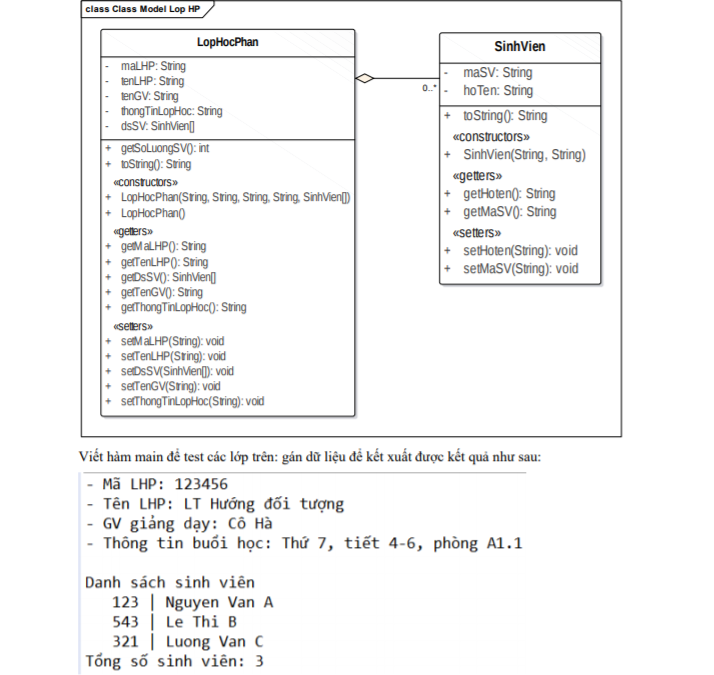
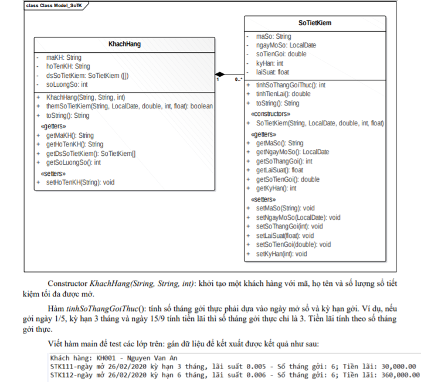
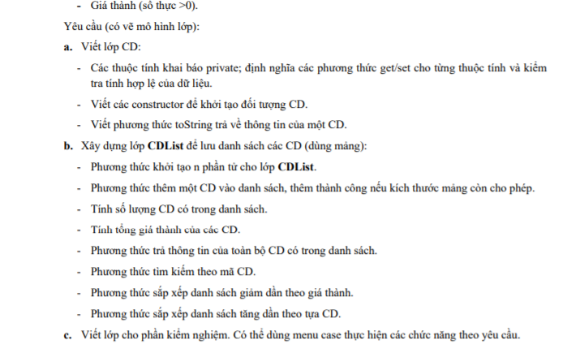
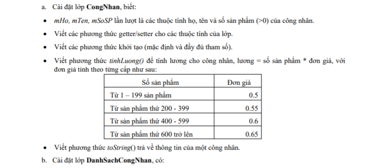
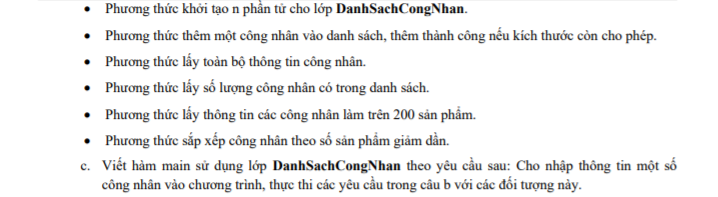
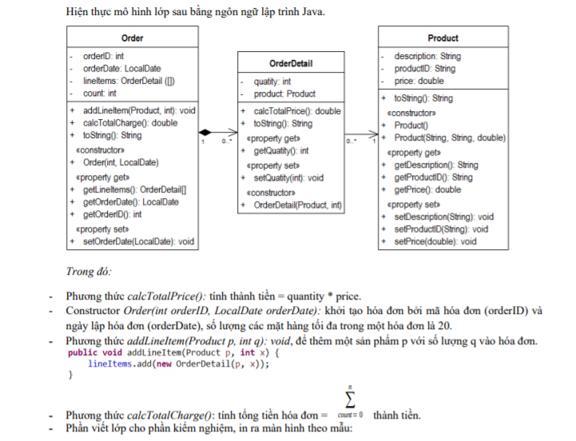
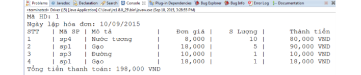

# Bài Tập OOP Java - Module 2

1. **Bài 2:**
   
    
    
2. **Bài 3:**
    
3. **Bài 4:**
    
4. **Bài 5:**
    
    
5. **Bài 6:**
    
    
    
6. **Bài 7:**
   
7. **Bài 8:**
    
8. **Bài 9:**
    
9.  **Bài 10:**
    
    
10. **Bài 11:**
    
    
11. **Bài 12:**
    
    
