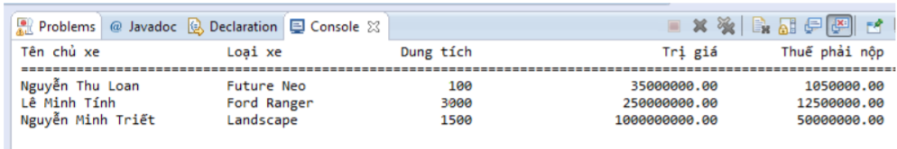
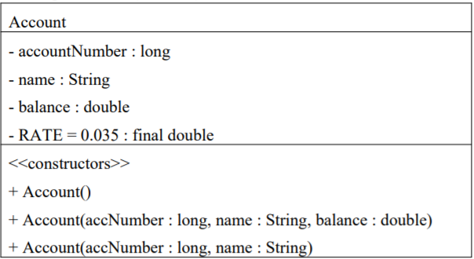

# Bài Tập OOP Java - Module 2

1. **Bài 2:**
    a. Viết lớp sinh viên như sau:
    **Attributes:**
    - Mã sinh viên (số nguyên > 0),
    - Họ tên (chuỗi, không được rỗng),
    - Điểm LT, điểm TH (số thực, thuộc `[0.0,10.0]`)

    **Methods:**
    - Constructor mặc định (gán giá trị mặc định)
    - Constructor nhận đầy đủ thông tin để khởi tạo giá trị cho tất cả các biến instance
    - Các `getter` và `setter` cho mỗi thuộc tính
    - Tính điểm trung bình (trung bình = (điểm LT + điểm TH)/2)
    - Phương thức `toString` diễn tả đối tượng ở dạng chuỗi gồm 4 thông tin là mã sinh viên, họ tên, điểm LT, điểm TH, điểm TB.
Yêu cầu kiểm tra **ràng buộc dữ liệu**, **gán giá trị mặc định** khi dữ liệu không hợp lệ.

    b. Xây dựng class chứa hàm main: tạo 3 đối tượng sinh viên `sv1`, `sv2`, `sv3`, trong đó:
    - `sv1` chứa thông tin của chính mình (tạo bằng constructor đủ thông số, thông tin biết rồi nên khỏi
yêu cầu nhập).
    - `sv2` là thông tin một người bạn của bạn (tạo bằng constructor mặc định, thông tin cũng biết rồi
khỏi yêu cầu nhập).
    - `sv3` tạo bằng cách yêu cầu nhập lần lượt từng thông tin của sinh viên rồi gán vào sv3 (SV nhận
xét nên dùng constructor mặc định hay dùng constructor đủ tham số để khởi tạo sv3?).
    - In bảng danh sách sinh viên gồm 4 cột là MSSV, họ tên, điểm LT, điểm TH, điểm TB (bảng có 3
dòng cho 3 sinh viên) như hình bên dưới.

    
    ```
    HD: Dùng String.format("chuỗi định dạng", đối số 1, đối số 2, ….); chuỗi định dạng giống c++, ví dụ:
    "%-30s": chuỗi, chiếm 30 ký tự, dấu trừ canh lề trái.
    "%5.2f": số thực, chiếm 5 ký tự, bao gồm 2 ký số lẻ.
    Ký tự định dạng:
    %s : chuỗi
    %d: số nguyên (byte, short, int, long)
    %f: số thực (float, double)
    %b: boolean
    ```
2. **Bài 3:**
    **a**.Cài đặt lớp hình tam giác, biết tam giác có 3 cạnh ma, mb, mc, viết các phương thức sau:
   - `Constructor` mặc định (không tham số).
   - `Constructor` đủ tham số: nếu giá trị truyền có số âm hoặc nếu 3 giá trị không lập thành hình tam giác thì gán 3 thuộc tính bằng 0.
   - Các phương thức `getter`/`setter`: nếu giá trị gán không hợp lệ (<0 hoặc giá trị mới không còn tạo thành tam giác) thì không gán gì cả.
   - Phương thức tính chu vi, tính diện tích.
   - Phương thức trả về thông tin kiểu tam giác là gì (thường, cân, đều, không phải tam giác).
   - Phương thức `toString` để diễn tả đối tượng ở dạng chuỗi gồm: thông tin 3 cạnh, kiểu tam giác, chu
vi, diện tích

    **b**.Viết hàm main tạo 5 hình tam giác, trong đó: 2 hình vi phạm ràng buộc, 3 hình lần lượt là tam giác *thường*, *cân*, *đều*. Xuất thông tin các hình này theo dạng bảng.
    
    ```
    Hướng Dẫn
    - Ba giá trị lập thành một hình tam giác khi và chỉ khi tổng hai cạnh bất kỳ luôn lớn hơn cạnh còn lại.
    - Công thức tính diện tích tam giác: 
    ```
    > p = (a + b + c) / 2
    > s = sqrt(p (p - a) (p - b) (p - c))

3. **Bài 4:**
    Cho mô tả bài toán:
    Sở giao thông cần theo dõi việc đăng ký xe (ThongTinDangKyXe) của người dân, cần lưu các thông tin gồm: *chủ xe*, *loại xe*, t*rị giá xe (>=0)*, *dung tích xylanh (>=0)*. Dựa vào thông tin *trị giá xe* và *dung tích xylanh*, sở giao thông cũng tính mức thuế phải đóng trước bạ khi mua xe như sau:
    - Dưới 100cc, 1% trị giá xe.
    - Từ 100 đến 200cc, 3% trị giá xe.
    - Trên 200cc, 5% trị giá xe.

    *a*. Hãy thiết kế và cài đặt lớp ThongTinDangKyXe với các attributes và methods phù hợp, *ném lỗi ra ngoài nếu vi phạm ràng buộc dữ liệu* Lớp phải có các constructor và phải bảo đảm tính encapsulation.

    *b*. Xây dựng class chứa hàm main, có các công việc:
   - Tạo mảng 3 đối tượng xe1, xe2, xe3. Dữ liệu được gán sẵn hoặc cho người dùng nhập.
   - Xuất bảng kê khai tiền thuế trước bạ của các xe như mẫu:
    
    
4. **Bài 5:**
    Lớp **HangThucPham** mô tả hàng hóa là hàng thực phẩm trong kho của một cửa hàng tiện lợi, có các thuộc tính: **mã hàng** *(không cho phép sửa, không được để rỗng)*, **tên hàng** (*không được để rỗng, mặc định là “xxx”)*, **đơn giá** *(>=0)*, **ngày sản xuất** *(phải trước ngày hiện tại, mặc định là ngày hiện tại)* và **ngày hết hạn** *(phải sau ngày sản xuất, mặc định là ngày sản xuất)*. Yêu cầu:

    a. Viết các phương thức setters/getters cho lớp HangThucPham. Trong các setter (ngoại trừ hàm set mã hàng), *nếu dữ liệu muốn gán không hợp lệ thì gán giá trị mặc định* tương ứng của trường đó.

    b. Tạo một constructor có đầy đủ tham số và một constructor có tham số là mã hàng. *Nếu mã hàng rỗng thì phát sinh lỗi và không cho phép tạo đối tượng đó, các giá trị khác nếu không hợp lệ thì để mặc định.*

    c. Viết phương thức kiểm tra một hàng thực phẩm đã hết hạn chưa.
    
    d. Phương thức toString trả về chuỗi chứa thông tin của hàng thực phẩm, bao gồm thông tin đã hết hạn chưa. *Trong đó: định dạng đơn giá có phân cách hàng nghìn; định dạng kiểu ngày là dd/MM/yyyy.*

    e. Viết lớp khác chứa hàm main: Tạo 3 đối tượng, trong đó có một đối tượng có ngày hết hạn trước ngày sản xuất. Xuất thông tin 3 mặt hàng này như mẫu:

    

    f. Kiểm thử lớp HangThucPham với các ràng buộc đã cho.

    >*HD*:
    >***- Kiểm tra mã hàng:***
    > ```
    >private void setMaHang(String maHang) throws Exception {
    >   if(!maHang.trim().equals(""))
    >       this.maHang = maHang;
    >   else
    >       throw new Exception("Lỗi: Mã hàng rỗng !");
    >}
    >```
    >- ***Kiểu ngày:*** dùng lớp định nghĩa sẵn LocalDate
    >   - Tạo đối tượng: LocalDate ngay = LocalDate.of(2018, 12, 31);
    >   - Xuất ngày (định dạng là dd/MM/yyyy)
    >   *DateTimeFormatter dtf = DateTimeFormatter.ofPattern("dd/MM/yyyy");*
    >   *String sngay = dtf.format(ngay);*
    >   *System.out.println(sngay);*
    >   ***- Kiểm tra ngày này trước hoặc sau ngày kia:*** dùng phương thức *isBefore*, *isAfter*.
    >   ***- Kiểm tra hàng đã hết hạn chưa:***
    >```
    >private boolean hetHan() {
    >    return ngayHetHang.isBefore(LocalDate.now()) ? true : false;
    >}
    >```
    >   ***- Định dạng số phân cách hàng nghìn:*** *DecimalFormat df = new DecimalFormat("#,##0.00");*
5. **Bài 6:**
    **(i)** Cài đặt cho lớp tài khoản (Account) được thiết kế như sau:
    
    

    Mô tả lớp Account:
   - Ba constructor: **constructor mặc định** (số tài khoản = 999999, tên tài khoản = “chưa xác định”, số dư = 50000); **constructor đầy đủ tham số**; **constructor có hai tham số**. *Trong trường hợp giá trị tham số không hợp lệ thì gán giá trị mặc định cho thuộc tính tương ứng (dữ liệu gán là hợp lệ khi số tài khoản > 0, tên tài khoản khác rỗng, số dư >= 50000).*
    - **deposit**(*amount* : double): cho phép gởi thêm số tiền *amount* vào tài khoản, hàm trả về *true* nếu gởi thành công (*amount* > 0).
   - **withdraw**(*amount* : double, *fee* : double): cho phép rút số tiền *amount* từ tài khoản, hàm trả về *true* nếu rút tiền thành công (*amount* > 0 và *amount + fee <= balance*).
   - **addInterest**(): tính tiền lãi, *balance = balance + balance * RATE*.
   - **transfer**(*acc2* : Account, *amount* : double): chuyển một khoản tiền *amount* từ *account* này sang *account* kia, trả về *true* nếu chuyển thành công.
   - **toString** trả về chuỗi chứa toàn bộ thông tin tài khoản, yêu cầu định dạng kiểu tiền tệ

    >*HD:* Định dạng tiền tệ:
    >1. Tạo đối tượng Locale: Xác định ngôn ngữ và quốc gia áp dụng: Locale local= new Locale("mã NN", "mã QG"). Ví dụ:
    >   **Locale** local = new **Locale**("vi", "vn");
    >2. Tạo đối tượng NumberFormater với tham số Locale ở trên: Ví dụ:
    >   **NumberFormat** formatter = **NumberFormat**.getCurrencyInstance(local);
    >3. Dùng formater để định dạng: ví dụ: formater(456953.12);
    >[formater sau khi định dạng sẽ trả về chuỗi số đã định dạng]

    **(ii)** Test lớp Account như sau :
    - Tạo 3 đối tượng acc1, acc2, acc3 với các giá trị name, accountNumber, balance lần lượt như sau: `{"Ted Murphy", 72354, 102.56}; {"Jane Smith", 69713, 40.00}; {"Edward Demsey", 93757,759.32}.`
   - Gởi thêm số tiền cho acc1 là 25.85, cho acc2 là 500.00.
   - Rút khỏi acc2 số tiền là 430.75, mức phí 1.50.
   - Tính tiền lãi cho acc3.
   - Xuất thông tin của acc1, acc2, acc3 (kiểm tra lại kết quả).
   - Chuyển tiền từ acc2 sang cho acc1 số tiền là 100.00.
   - Xuất thông tin của acc1, acc2 (kiểm tra lại kết quả)
  
6. **Bài 7:**
7. **Bài 8:**
8. **Bài 9:**
9.  **Bài 10:**
10. **Bài 11:**
11. **Bài 12:**
12. **Bài 13:**
