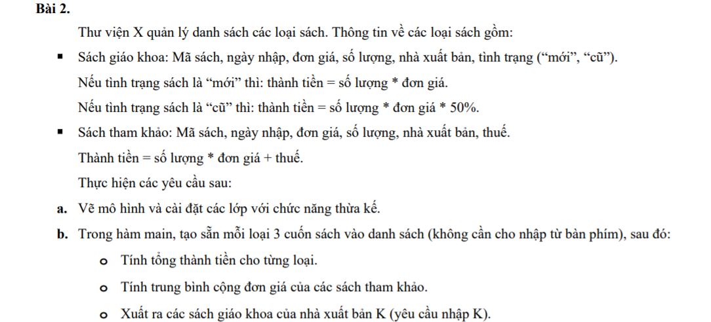
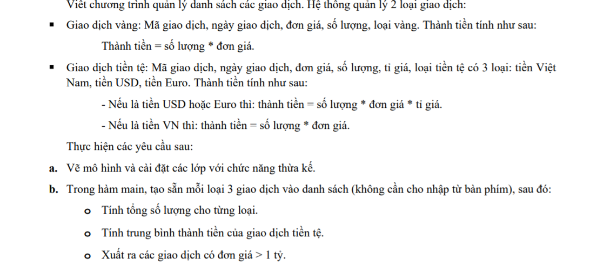
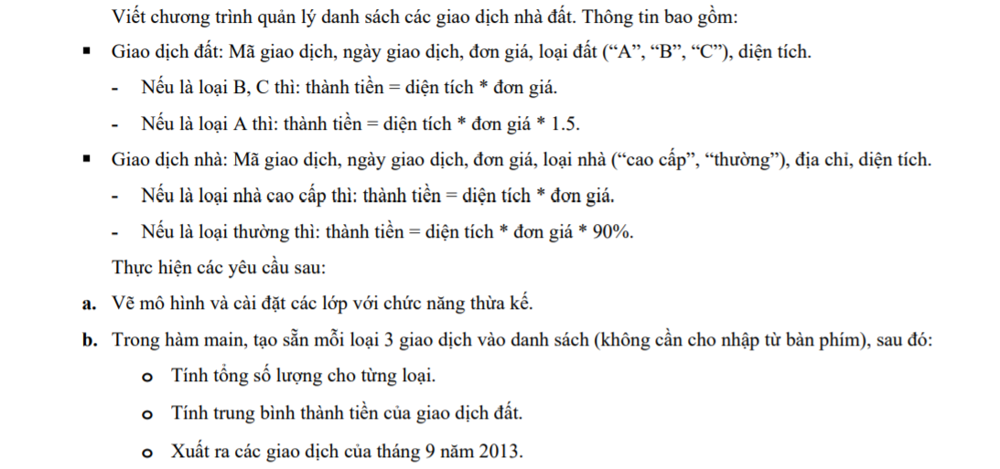
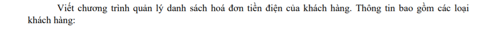
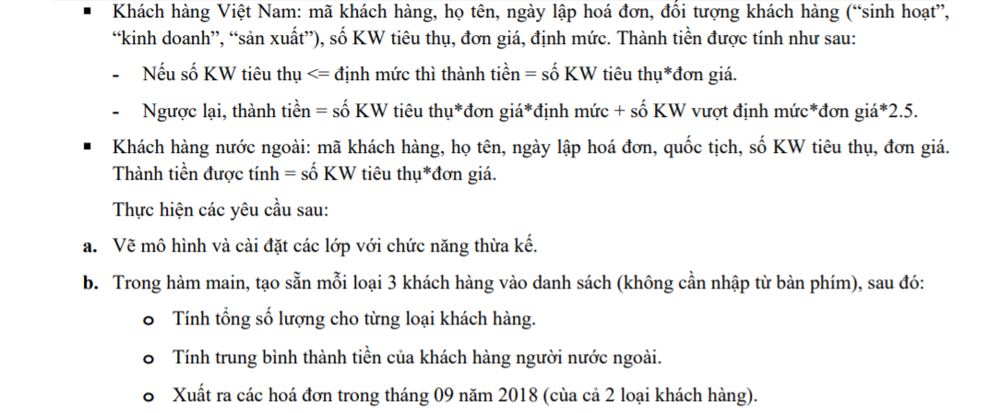
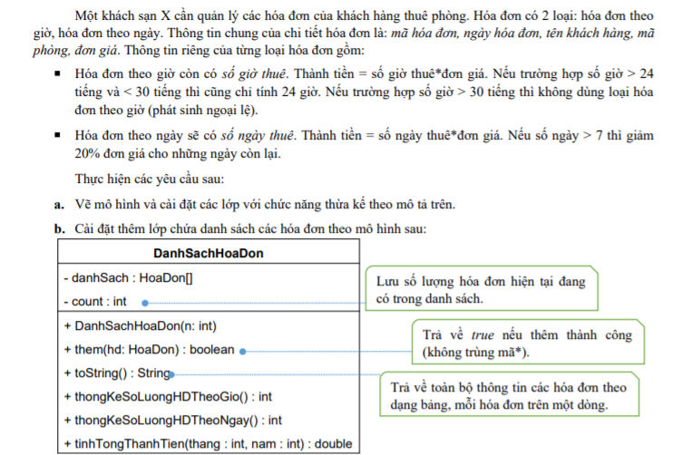
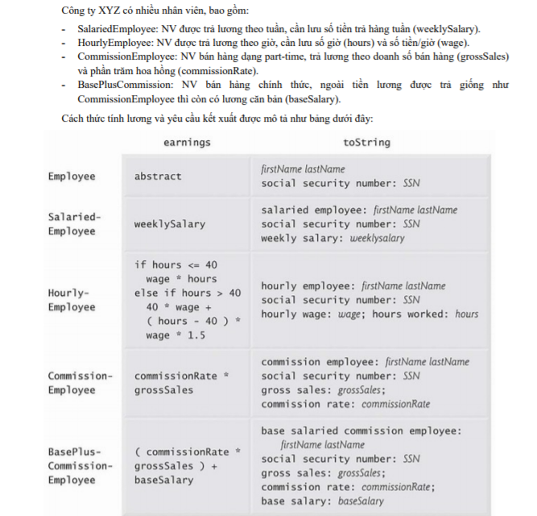
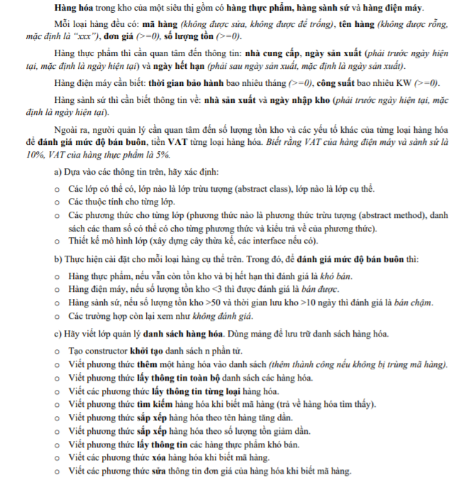
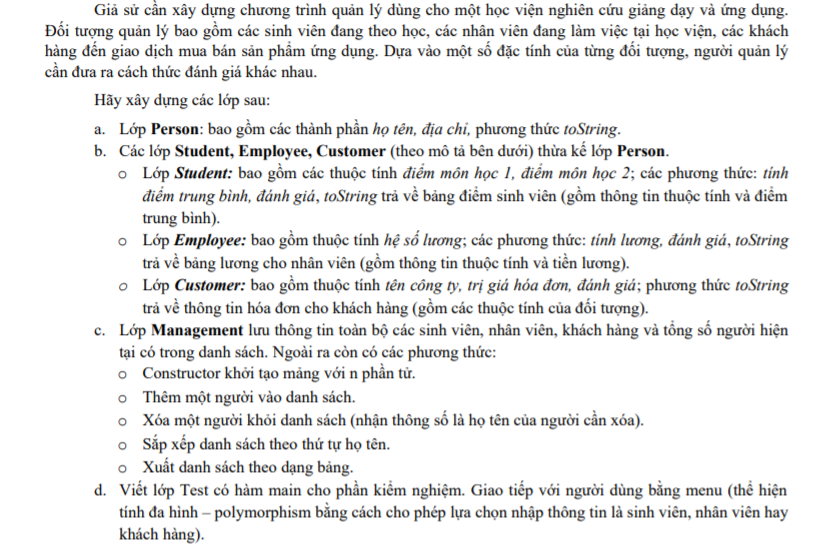

# Bài Tập OOP Java - Module 4

1. **Bài 2:** -----------------------------  
    
2. **Bài 3:** -----------------------------  
    
3. **Bài 4:** -----------------------------  
      
4. **Bài 5:** -----------------------------  
      
      
5. **Bài 6:** -----------------------------  
      
      
6. **Bài 7:** -----------------------------  
      
7. **Bài 8:** -----------------------------  
      
      
8. **Bài 9:** -----------------------------  
      